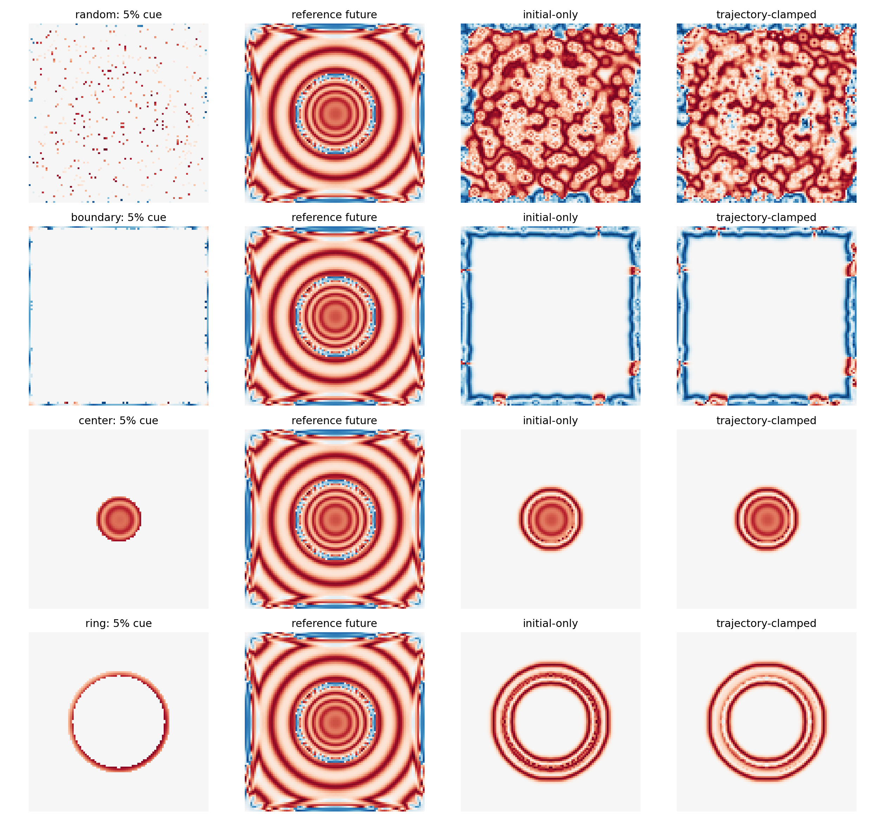
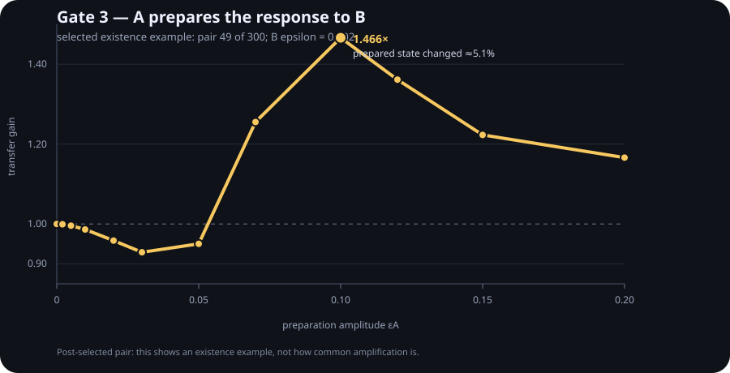
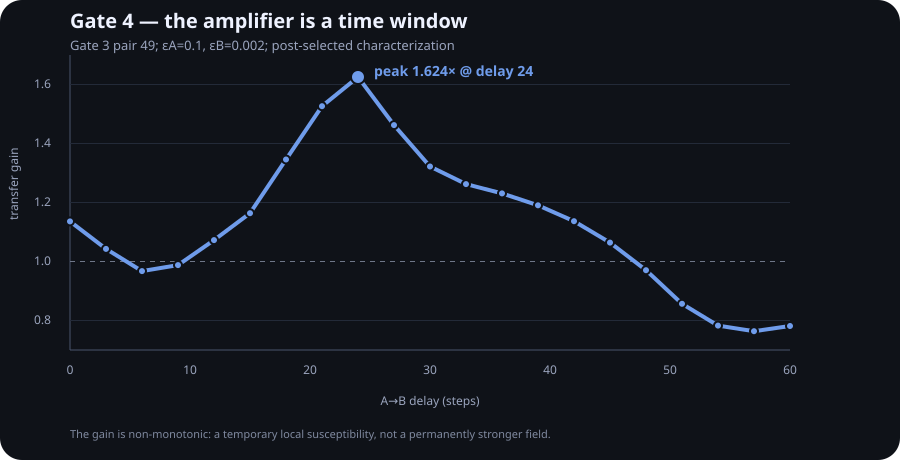

# Kompressori



**Compress the state. Then ask whether you also compressed the future operator.**

Kompressori starts from the old PhiWorld-style nonlinear field, but the goal is no longer to make a "hologram" claim. The question became narrower and, so far, more productive:

> A partial state can preserve part of the visible future while failing to preserve how the system responds to the *next* perturbation.

That distinction matters for any adaptive system. A memory guard, compressed world-model, recurrent substrate, or learned latent may reproduce today's answers yet have a very different local response geometry.

## Gate 0 — future fidelity is not response fidelity

We evolve the PhiWorld-like field to a structured state `s=(phi, phi_old)`, retain only a fraction of the cells, and zero the hidden state.

Two measurements are made on hidden cells over a 50-step future:

1. **future correlation** — does the compressed state follow the same future trajectory?
2. **response correlation** — after applying the same tiny Gaussian displacement to full and compressed states, do their *changes* follow the same trajectory?

The second is a finite-difference tangent-response test. The probe is small enough to be close to linear: halving it and doubling its response disagrees with the full probe by at most **0.043 relative error** across the three default probe seeds.

At a **5% square-edge-shaped cue**:

- future correlation: **0.408**
- response correlation: **0.004**
- response gain ratio: **4.389** (`1.0` would match the full state's response magnitude)

So the cue retains a nontrivial resemblance to the future while its response to the next perturbation is essentially unrelated and about 4.4× too large.

```text
looks similar later
        !=
has the same future sensitivity
```

At **25% random** observation the two correlations become closer (`future=0.517`, `response=0.481`), though the response is still amplified (`gain=1.434`). At **50% energy-selected** cells the future correlation reaches `0.665` and response correlation `0.516`, with gain `0.827`. None is yet strong completion.

## Gate 1 — optimizing the future does not recover the response

Gate 1 fixes the observation budget at **5%**, generates **200 random masks**, and ranks them using **only future trajectory correlation**. It then surprises every compressed state with five perturbation packets that were not used for selection.

Result:

- Pearson correlation between future fidelity and response fidelity across the 200 masks: **0.026**
- best future-only mask: future `0.344`, unseen response `0.070`, response gain `3.293`
- best response-preserving mask: future `0.296`, unseen response `0.340`, response gain `2.693`
- the response-best mask ranked only **71st** by future fidelity

So, in this toy search, **future/replay fidelity is almost no guide to perturbation-response fidelity**. This is not a universal theorem and not evidence about brains. It is a concrete counterexample to a tempting engineering assumption: choosing a compressed state because it reproduces known trajectories can leave the local future operator badly wrong.

## Gate 2 — checking a few perturbations does not certify the operator

The obvious repair to Gate 1 is: *fine, then guard the response too.* Gate 2 attacks that repair.

At a fixed **5%** observation budget we generated 140 random masks and kept the top quarter by future fidelity. In each of six cross-validation splits, four localized perturbations were used to select the response-aware mask and four different perturbations were held out.

The response-aware selector genuinely learned its training probes:

- training response correlation: `0.050 → 0.177`
- training relative response error: `2.161 → 1.826` (lower is better)

But the improvement did **not** transfer to unseen perturbation directions:

- held-out response correlation: `0.108 → 0.076`
- held-out relative response error: `2.035 → 2.131`

So at this sparse state-only budget, a small perturbation test suite can itself be overfit. The guard can preserve the answers to the probes without preserving the local future operator that generated them.

That changes the engineering question again:

```text
replay old outputs        -- not enough
probe a few responses     -- still not enough here
preserve / constrain the response geometry itself ?
```

The exact receipt is `results/gate2/receipt.json`.

## Gate 3 — a finite perturbation can prepare the next perturbation

This was the experiment we actually wanted from the Euler-inspired parent→child thought.

Apply packet **A**, wait 20 steps, then apply a much smaller packet **B**. Subtract the A-only future so that we isolate B's response. Define

```text
transfer gain = || response to B after A || / || response to B without A ||
```

At tiny `εA = 0.002`, a 300-pair search stayed essentially in the linear-superposition regime: the **maximum** transfer gain was only **1.00029**.

At finite `εA = 0.1`, most pairs were still near 1 — but one nearby pair produced:

- transfer gain: **1.46637×**
- response correlation with the unprepared B response: **0.886**
- A/B packet-center distance: **2.38 cells** on the periodic grid
- change in the delayed state caused by A: **5.08%** in relative norm



For that discovered pair, increasing A first **suppresses** B (`gain=0.929` at `εA=0.03`), then flips into amplification (`1.255` at `0.07`, `1.466` at `0.10`). This is not just a large-B artifact: varying B from `0.0005` to `0.008` leaves the measured transfer gain around **1.45–1.47×**.

The effect is also strongly local in this search. For A/B separations above 15 cells, the largest gain among 168 tested pairs was only about `1.00000047`; the large amplifiers appeared in the `<5 cell` bin.

This is the first result here that resembles the abstract **parent → changes geometry → child sees a different amplifier** idea. But the qualification matters: pair 49 was deliberately selected as the maximum-gain example out of 300. Gate 3 is therefore an **existence demonstration in this toy field**, not evidence that amplification is common, not fluid blowup, and not a brain mechanism.

## Gate 4 — the amplifier is a local susceptibility window

Gate 4 takes the post-selected Gate 3 pair seriously enough to characterize it, but **not** as independent evidence. We hold A and B fixed and vary the delay, then at the best delay hold A fixed and scan B over 400 positions.

The first surprise is temporal. The same A/B pair is not simply "stronger after A":

- delay `0`: gain **1.136×**
- delay `6`: gain **0.967×** — slight suppression
- delay `18`: gain **1.346×**
- delay `21`: gain **1.526×**
- delay `24`: gain **1.624×** — peak
- delay `30`: gain **1.322×**
- delay `48`: gain **0.970×**
- delay `57`: gain **0.764×**



So A creates a **finite susceptibility window**, not a monotonic increase in gain.

The second surprise is spatial. At the peak delay (`24`), B was placed on a 20×20 grid of positions across the periodic field. Out of 400 locations:

- mean gain: **1.011×**
- 95th percentile: **1.029×**
- only **13 / 400** positions exceeded `1.1×`
- only **3 / 400** exceeded `1.4×`
- maximum: **1.647×** at `(16, 32)`, only **2.13 cells** from A's center

That makes the Gate 3 effect look much less like a globally growing mode and much more like a **temporary local pocket of altered response geometry**.

This matters for the Euler analogy too. The useful abstraction was never "PhiWorld blows up like Euler." Gate 4 says our toy effect is currently more modest and more specific:

```text
A happens
   ↓
local state geometry changes
   ↓
a nearby B arriving in the right time window
sees a different gain
   ↓
the window later closes / reverses
```

That is already enough to make "future sensitivity" a dynamical object rather than a fixed property of the state snapshot.

## Why the old PhiWorld result belongs here

The predecessor probe tested partial-field completion in two modes: one-shot partial initial state and continuous trajectory clamping. It explicitly measured only hidden cells. The old result did **not** show a holographic reconstruction attractor: distributed random samples helped more than compact center/ring cues, but even 50% random observation only reached modest hidden correlation, and no mask reached 0.75 mean correlation in the supplied run.

Kompressori keeps that negative result as the baseline and asks the missing second question: **did the compressed state retain the response geometry?**

A detail worth making explicit: the simulation Laplacian uses `np.roll`, so the domain is periodic. The `edge` mask is a square-shaped observation geometry; it is **not a physical boundary condition**.

## Euler / Navier–Stokes inspiration, without overclaiming

OpenAI's September 2026 release proposes finite-time blowup results for Navier–Stokes and Euler and supplies Lean formalizations. The conceptual prompt we borrow is not "PhiWorld is a fluid". It is the more general idea that perturbations can be transformed by the current state into finite-time response geometries with different amplification properties.

For Kompressori the operational translation is:

```text
preserve state / answers
        ↓
not enough
        ↓
preserve finite-time response geometry
        ↓
and ask whether one event can reshape it for the next event
```

Official sources:

- https://openai.com/research/
- https://github.com/openai/NavierStokesAndEuler

## Run

```bash
python -m pip install numpy
python kompressori.py
python gate1_search.py
python gate2_crossvalidate.py
python gate3_transfer.py
python gate4_kernel.py
```

The longer supplied receipts used:

```bash
python gate1_search.py --horizon 50 --candidates 200 --probe-seeds 5
python gate2_crossvalidate.py --grid 36 --horizon 25 --candidates 140 --probes 8 --splits 6
python gate3_transfer.py --grid 40 --delay 20 --horizon 25 --pairs 300 --small-a .002 --search-a .1 --epsilon-b .002
python gate4_kernel.py --grid 40 --pair 49 --epsilon-a .1 --epsilon-b .002 --horizon 25 --delay-max 60 --delay-step 3 --map-step 2
```

## Repo map

- `kompressori.py` — Gate 0 future-vs-response experiment
- `gate1_search.py` — future-only mask search, followed by unseen response tests
- `gate2_crossvalidate.py` — response-aware guard with held-out perturbation directions
- `gate3_transfer.py` — A→B perturbation-transfer search
- `gate4_kernel.py` — temporal and spatial transfer-kernel characterization
- `results/gate0/receipt.json` — Gate 0 receipt
- `results/gate1/receipt.json` — Gate 1 receipt
- `results/gate2/receipt.json` — Gate 2 receipt
- `results/gate3/receipt.json` — Gate 3 receipt
- `results/gate3/amplitude_sweep.svg` — Gate 3 visual
- `results/gate4/receipt.json` — Gate 4 receipt
- `results/gate4/delay_sweep.svg` — Gate 4 visual
- `legacy/phiworld_completion_probe.py` — predecessor experiment
- `legacy/completion_summary.json` — predecessor receipt supplied with the experiment
- `index.html` — dependency-free visual summary for GitHub Pages
- `test_kompressori.py` — smoke tests

## Next gates

- **G5 — independent transfer scan:** stop leaning on post-selected pair 49. Pre-register a coarse A×B×delay scan and ask how often local susceptibility windows occur across the field.
- **G6 — operator compression:** stop asking a sparse state mask to do the impossible. Compare state-only compression with a small tangent/impulse sketch. How many response directions must be retained before held-out perturbations become predictable?
- **G7 — slow substrate:** let response geometry itself change slowly and ask which constraints prevent a local A→B amplifier from becoming runaway self-amplification.
- **G8 — learning guard:** move the distinction into an adaptive model: preserve stored answers versus preserve nearby impulse/Jacobian responses around them.

The repo succeeds if these gates kill the seductive story quickly or turn it into a measurable mechanism.
