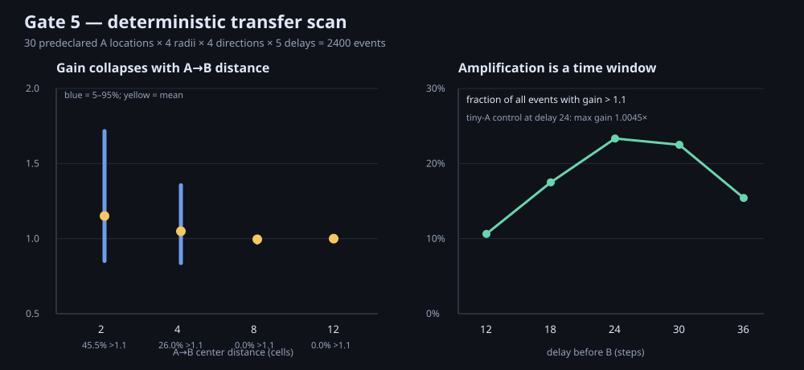
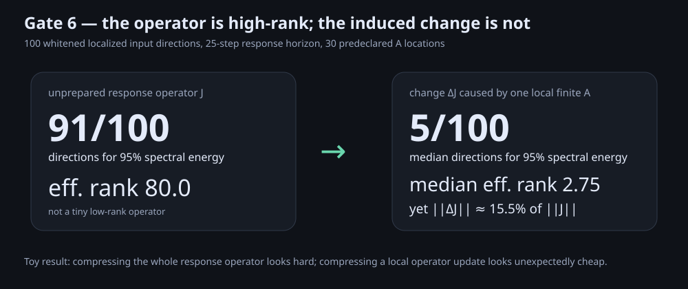
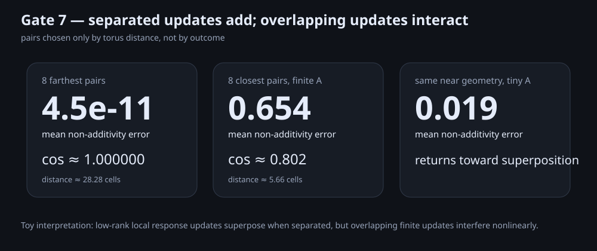

# Kompressori


**Compress the state. Then ask whether you also compressed the future operator.**

[Static experiment page](https://anttiluode.github.io/Kompressori/)

Kompressori started from the old PhiWorld partial-field / “hologram?” experiment. That story mostly failed: tiny pieces did not magically regenerate the whole field. The failure exposed a better question.

> A representation can preserve what a system does while failing to preserve how it will respond to what happens next.

That distinction now drives the repo. The object of interest is not only the field state `phi(x)`, but its **finite-time response geometry**: how a perturbation arriving at one place and time is amplified, suppressed, or redirected by the current state.

```text
state snapshot
     ↓
known future                         — one object

state snapshot + next perturbation
     ↓
finite-time response                 — another object
```

This is a toy nonlinear field. It is **not** a Navier–Stokes solver, not evidence for holography, and not a brain model. The Euler/Navier–Stokes work supplied a useful conceptual prompt: current geometry can transform the next perturbation.

---

## Gate 0 — future fidelity is not response fidelity

We evolve the PhiWorld-like field to a structured state `s=(phi, phi_old)`, retain only some cells, zero the hidden cells, and compare two hidden-region quantities over a 50-step future:

1. **future correlation** — does the compressed state follow the same trajectory?
2. **response correlation** — after the same tiny perturbation is applied to full and compressed states, do their *difference trajectories* match?

At a **5% square-edge-shaped observation mask**:

- future correlation: **0.408**
- response correlation: **0.004**
- response gain: **4.389×**

So a state can remain recognizably related to the known future while behaving almost like a different machine under the next perturbation.

```text
looks similar later
        !=
has the same future sensitivity
```

The domain is periodic (`np.roll` Laplacian). “edge” is therefore only an observation geometry, not a physical boundary condition.

---

## Gate 1 — optimizing replay does not recover the response

At a fixed **5%** observation budget, Gate 1 generates 200 random masks and ranks them **only by future trajectory fidelity**. Five unseen perturbations are then applied.

- future ↔ response Pearson correlation across masks: **0.026**
- best future-only mask: future `0.344`, unseen response `0.070`
- best response mask: future `0.296`, unseen response `0.340`
- the response-best mask ranked only **71st** by future fidelity

In this toy search, replay/future fidelity is almost no guide to response fidelity.

---

## Gate 2 — a few response probes can also be overfit

The obvious repair is to guard the response explicitly. Gate 2 cross-validates that idea.

At 5% state budget, four perturbations select a response-aware mask and four different perturbations test it.

Training improves:

- response correlation: `0.050 → 0.177`
- relative response error: `2.161 → 1.826`

Held-out directions do not:

- response correlation: `0.108 → 0.076`
- relative response error: `2.035 → 2.131`

So:

```text
replay old outputs       — not enough
probe a few responses    — still not enough here
preserve response geometry itself ?
```

---

## Gate 3 — one perturbation can prepare the next

Now compression is temporarily removed from the story.

Apply finite packet **A**, wait, then apply much smaller packet **B**. Subtract the A-only future so B's contribution is isolated:

```text
transfer gain = || response to B after A || / || response to B without A ||
```

At tiny `epsilon_A = 0.002`, a 300-pair search stays essentially linear: maximum gain **1.00029×**.

At finite `epsilon_A = 0.1`, a deliberately post-selected nearby pair reaches **1.466×**. The same pair first suppresses B and then amplifies it as A grows:


The effect survives shrinking B across a 16× amplitude range, so B itself remains a small probe. But pair 49 was selected as the maximum among 300 pairs; Gate 3 is an existence example, not a prevalence estimate.

---

## Gate 4 — the amplifier is a local susceptibility window

Gate 4 characterizes that post-selected pair without pretending it is independent evidence.

The gain depends strongly on **when** B arrives:

- delay `6`: **0.967×**
- delay `18`: **1.346×**
- delay `21`: **1.526×**
- delay `24`: **1.624×**
- delay `48`: **0.970×**
- delay `57`: **0.764×**


At the peak delay, B was scanned over 400 positions. Only 13 exceeded `1.1×`, only 3 exceeded `1.4×`, and the maximum occurred just **2.13 cells** from A.

So the effect looks like a **temporary local susceptibility pocket**, not a global unstable mode.

---

## Gate 5 — the local effect survives removal of post-selection

Gate 5 finally stops leaning on pair 49.

Before measuring any gain it fixes:

- **30 deterministic A locations** from a modular sequence
- B distances `2, 4, 8, 12`
- four cardinal B directions
- delays `12, 18, 24, 30, 36`

That gives **2400 outcome-independent A→B events**.



The locality is extremely sharp:

| A→B distance | mean gain | 95th percentile | fraction > 1.1× |
|---:|---:|---:|---:|
| 2 | **1.151** | **1.716** | **45.5%** |
| 4 | **1.049** | **1.355** | **26.0%** |
| 8 | 0.996 | 1.010 | **0%** |
| 12 | 1.000 | 1.00015 | **0%** |

Across the 1200 near-field events (`r <= 4`), **35.75%** exceed `1.1×`; across the 1200 far-field events (`r >= 8`), **none** do.

A tiny-A control at the same near-field geometry stays almost linear: maximum gain **1.00446×**.

Gate 5 therefore improves the claim and simultaneously kills the more seductive one:

> **Local nonlinear susceptibility is common in this toy field. A travelling or long-range amplification cascade is not supported by this scan.**

---

## Gate 6 — the whole operator is high-rank; the update is low-rank

This is where Kompressori changed direction again.

Gate 2 suggested that storing a few response probes is insufficient because the response operator may simply be too large. Gate 6 measures that directly.

A 10×10 grid of localized Gaussian B packets gives **100 sampled input directions**. Because those packets overlap, their input Gram matrix is whitened before reading the generalized singular spectrum.

For the unprepared finite-time response operator `J` at delay 24:

- 90% spectral energy requires **82 / 100** directions
- 95% requires **91 / 100**
- 99% requires **98 / 100**
- effective rank: **80.0**

So the operator itself is emphatically not a tiny low-rank object.

Then apply one finite local A and measure

```text
Delta J = J_after_A - J_before_A
```

across the same 30 deterministic A locations.



The result is almost the opposite:

- median 90%-energy rank of `Delta J`: **4 / 100**
- median 95%-energy rank: **5 / 100**
- median 99%-energy rank: **8 / 100**
- median effective rank: **2.75**

This is not merely numerical dust. The median generalized Frobenius norm of `Delta J` is about **15.5% of the full operator norm**; across A locations it ranges from about 9.3% to 23.1%.

So the compressible object may not be the operator.

It may be the **change to the operator**.

```text
high-dimensional substrate J
        +
small local experience
        ↓
low-rank Delta J
```

That has an obvious conceptual resemblance to low-rank adaptation in machine learning, but this repo is not claiming equivalence or novelty relative to LoRA. Here it emerged as a measured property of this particular nonlinear field experiment.

---

## Gate 7 — separated low-rank updates add; overlapping ones interfere

If local events create low-rank response updates, the next question is unavoidable:

> Do two updates simply add?

Pair selection is based **only on distance**, never on measured response. Among the same 30 deterministic sites, Gate 7 tests the 8 closest and 8 farthest pairs.



For the **8 farthest pairs** (`distance ≈ 28.28` cells):

- mean non-additivity error: **4.48 × 10^-11**
- cosine between actual joint update and sum of individual updates: **1.000000**

They add to numerical precision.

For the **8 closest pairs** (`distance ≈ 5.66` cells) at finite `A=0.1`:

- mean non-additivity error: **0.654**
- median: **0.653**
- mean cosine actual-vs-sum: **0.802**

They do **not** simply add.

Repeat four near pairs with tiny `A=0.002` and the mean non-additivity falls to **0.0188**, cosine **0.99969**.

So a new picture appears:

```text
local event A                    local event B
      ↓                                ↓
low-rank Delta J_A               low-rank Delta J_B

far apart:      Delta J_AB ≈ Delta J_A + Delta J_B
near / finite:  Delta J_AB != Delta J_A + Delta J_B
```

In this toy field, **interference appears when local response-geometry updates overlap**.

That is much closer to the learning problem that motivated the other repos than the original “hologram” idea ever was.

---

## Gate 8 — distance is a proxy; operator-patch overlap predicts the collision

Gate 7 still left an ambiguity: perhaps physical distance itself is the mechanism.
Gate 8 measures each single-event low-rank `Delta J` first, then asks whether overlap
between those independently measured response subspaces predicts the later joint
non-additivity.

The pair panel is frozen before outcomes are measured: the Gate-7 closest/farthest
pairs plus three lexicographic pairs at each of six predeclared intermediate torus
distances, for **34 deterministic pairs** total.

The result is stronger than a near/far split:

- distance alone predicts log non-additivity extremely well: **R² = 0.974**
- 95%-energy **output-subspace overlap** predicts it even better in this panel: **R² = 0.992**
- a two-sided input+output overlap score gives **R² = 0.992**
- after subtracting the mean inside every *exact-distance* group, two-sided overlap
  still correlates **r = 0.837** with the remaining log-interference variation
- output-subspace overlap gives **r = 0.873** in that same-distance residual test

So geometry looks increasingly like a proxy for a more portable object:

```text
physical locality
      ↓
local low-rank operator patches
      ↓
patch overlap
      ↓
nonlinear interference / composition
```

This is still one deterministic toy field, not a general law. But it finally gives
the cross-repo program a positive mechanism candidate: **measure collision between
operator edits before deciding whether to reuse, protect, or allocate structure.**

See [the Gate 8 code](gate8_operator_overlap.py), [frozen receipt](results/gate8/receipt.json),
and [operator-patch memory hypothesis](OPERATOR_PATCH_MEMORY.md).

---

## Gate 9 — the overlap sketch can choose a safer pairing at the same distance

Gate 8 found a predictor. Gate 9 asks whether it can actually make a decision before
the joint interaction is observed.

The tested score—95%-energy output-subspace overlap—is fixed from Gate 8. At two
**exact** torus distances (`distance² = 58` and `122`), Gate 9 excludes the three
lexicographic pairs already used in Gate 8, ranks every remaining candidate using
only its two single-event `Delta J` sketches, selects the five lowest-overlap and
five highest-overlap candidates, and only then measures their joint non-additivity.

At `distance² = 58` (`distance ≈ 7.62`):

- five low-overlap choices: mean non-additivity **0.154**
- five high-overlap choices: mean **0.368**
- high / low ratio: **2.38×**

At `distance² = 122` (`distance ≈ 11.05`):

- five low-overlap choices: mean non-additivity **0.00215**
- five high-overlap choices: mean **0.0798**
- high / low ratio: **37.2×**
- every high-overlap choice interfered more than every low-overlap choice

That is the first **allocation-style positive result** in the repo:

```text
same physical distance
        +
single-event patch sketches only
        ↓
choose low-overlap pairing
        ↓
less later nonlinear interference
```

It is still not a learning result: the choices are field locations, the metric was
discovered on Gate 8, and there are only two fixed-distance panels. But this is the
mechanism we were missing. The next adaptive system should use the collision score
to decide where a useful learned edit goes.

See [Gate 9 code](gate9_patch_allocation.py) and [frozen receipt](results/gate9/receipt.json).

---

## Why the old PhiWorld picture still belongs here

The predecessor probe tried one-shot partial initial states and continuous sparse trajectory clamping, scoring only hidden cells. Distributed random samples helped more than compact center/ring cues, but no supplied mask reached 0.75 mean hidden correlation.

That negative result is now the origin story:

```text
Can a fragment reconstruct the field?
                ↓ mostly no
Can it reconstruct the response geometry?
                ↓ even less
What does experience change in that geometry?
                ↓ local susceptibility
What is compressible?
                ↓ the operator update
When do updates interfere?
                ↓ when they overlap
What predicts the overlap cost?
                ↓ the operator patches themselves
Can the patch predict where to place the next edit?
                ↓ yes, in a first fixed-distance allocation test
```

---

## Euler / Navier–Stokes inspiration, without overclaiming

OpenAI's September 2026 release proposes finite-time blowup results for Navier–Stokes and Euler and supplies Lean formalizations. Kompressori does **not** import those equations or claim a related singularity mechanism. The conceptual prompt was narrower: a perturbation can alter the geometry through which the next perturbation evolves.

Official sources:

- https://openai.com/research/
- https://github.com/openai/NavierStokesAndEuler

---

## Run

```bash
python -m pip install numpy
python kompressori.py
python gate1_search.py
python gate2_crossvalidate.py
python gate3_transfer.py
python gate4_kernel.py
python gate5_unbiased_scan.py
python gate6_lowrank_update.py --a-count 30
python gate7_update_composition.py
python gate8_operator_overlap.py
python gate9_patch_allocation.py
```

The long deterministic Gate 5 run writes its full `events.csv` locally as well as the JSON receipt and SVG summary.

## Repo map

- `kompressori.py` — G0 future-vs-response compression
- `gate1_search.py` — G1 future-only mask search
- `gate2_crossvalidate.py` — G2 held-out response guard
- `gate3_transfer.py` — G3 A→B transfer search
- `gate4_kernel.py` — G4 temporal/spatial susceptibility kernel
- `gate5_unbiased_scan.py` — G5 deterministic prevalence/locality scan
- `gate6_lowrank_update.py` — G6 generalized operator/update spectra
- `gate7_update_composition.py` — G7 spatial composition/interference
- `gate8_operator_overlap.py` — G8 low-rank patch-overlap predictor
- `gate9_patch_allocation.py` — G9 fixed-distance overlap-guided allocation
- `OPERATOR_PATCH_MEMORY.md` — cross-repo positive mechanism and adaptive test
- `results/gate*/receipt.json` — machine-readable receipts
- `results/gate*/summary.svg` — static visuals where applicable
- `legacy/` — predecessor PhiWorld completion experiment
- `index.html` — dependency-free GitHub Pages summary
- `test_kompressori.py` — smoke tests

## Next gates

- **G10 — adaptive allocation:** give a learner multiple places to realize the same useful edit; choose by predicted patch collision and compare with random, distance-only and answer-error allocation at matched task progress.
- **G11 — bounded patch acquisition:** estimate a useful `Delta J` sketch from a small probe budget instead of the full 100-direction panel, then test whether allocation still works on unseen collisions.
- **G12 — structural growth:** when every existing place collides with protected patches, allocate a new route. Compare with the same final capacity present from the beginning.
- **G13 — link versus split:** deliberately reuse overlap for related experiences and separate conflicting ones. Test transfer/co-recall against interference in one protocol.
- **IttnasNoruen handoff:** spend a fixed replay budget on old cue routes whose response-geometry patches are predicted to collide with the proposed new edit.

The repo succeeds if these gates kill the seductive story quickly or turn it into a measurable mechanism.
